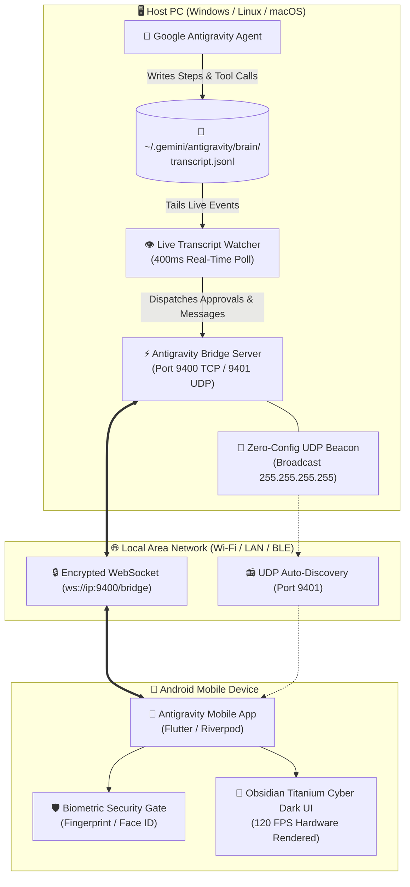

# Antigravity Mobile

<div align="center">


### The Production-Grade Mobile Companion & Biometric Approval Gateway for Google Antigravity on PC

[](https://flutter.dev)
[](https://dart.dev)
[](https://python.org)
[](#downloads--verified-releases)
[-success?logo=virustotal&logoColor=white)](#-security--integrity-verification)
[](LICENSE)
[](https://github.com/akiffurkan/antigravity-mobile/releases)

<p align="center">
  <a href="#-overview">Overview</a> •
  <a href="#-system-architecture">Architecture</a> •
  <a href="#-key-features">Features</a> •
  <a href="#-downloads--verified-releases">Downloads & SHA256</a> •
  <a href="#-security--integrity-verification">Virus & Security Audit</a> •
  <a href="#-installation--getting-started">Installation</a> •
  <a href="#-developer-guide">Developer Guide</a>
</p>

</div>

---

## 🌟 Overview

**Antigravity Mobile** is the official companion application designed to remotely supervise, monitor, and approve operations initiated by **Google Antigravity** on your PC. 

While Antigravity executes complex coding tasks, builds, migrations, and terminal commands in the background on your workstation, you retain complete oversight from your mobile device. With zero-configuration network pairing, real-time transcript streaming, and a biometric-backed approval gate, you can safely review and approve sensitive actions anywhere on your local network.

---

## 🏗️ System Architecture



---

## ✨ Key Features

### 🛡️ Real-Time Biometric Approval Gateway
* Intercepts and reviews sensitive agent tool operations (`run_command`, `write_to_file`, `replace_file_content`).
* Automatically assesses risk levels (**LOW**, **MEDIUM**, **HIGH**, **CRITICAL**).
* Commands marked **HIGH** or **CRITICAL** (e.g. `git push`, `rm -rf`, database schema updates) mandate on-device biometric confirmation (Fingerprint / Face Unlock).

### ⚡ Zero-Config LAN Discovery
* Built-in UDP beacon engine on port **9401**.
* Tap **Scan Devices** on your phone to instantly locate your PC without typing IP addresses or hostnames.
* Dual-transport architecture with automatic fallback between **Wi-Fi** and **Bluetooth LE**.

### 💬 Live Agent Stream & Multi-Session Switcher
* Connects directly to local Antigravity brain sessions.
* Streams agent reasoning, thinking blocks, and markdown responses to your phone in real time.
* Seamlessly inspect past conversation history across up to 30 past project workspaces.

### 💎 Obsidian Titanium Cyber Dark UI
* Tailored for high-end AMOLED and OLED displays.
* Minimalist Obsidian `#0B0D11` cyber aesthetic with neon mint `#00FF9D` status telemetry and titanium silver accents.
* Zero GPU overhead, zero sluggish backdrop blurs — guaranteed butter-smooth **120 FPS**.

---

## 📦 Downloads & Verified Releases

Each official release bundle provides a signed installer for Windows and an optimized APK for Android.

### 🏷️ Release v1.0.0 Assets

| Asset Name | Target Platform | Size | Description |
| :--- | :--- | :--- | :--- |
| **[`antigravity-mobile-v1.0.0-windows-android.zip`](releases/v1.0.0/antigravity-mobile-v1.0.0-windows-android.zip)** | Windows & Android | ~35.2 MB | **Complete Release Bundle** (Includes Installer EXE, APK, and Readme) |
| **[`bridge-server-install.exe`](releases/v1.0.0/package/bridge-server-install.exe)** | Windows 10 / 11 (x64) | 9.24 MB | Standalone PC Bridge Server & Service Installer (No Python required) |
| **[`antigravity-mobile.apk`](releases/v1.0.0/package/antigravity-mobile.apk)** | Android 8.0+ (ARM64/x86_64) | 56.3 MB | Companion Android Client APK |
| **[`antigravity-mobile-v1.0.0-source.zip`](releases/v1.0.0/antigravity-mobile-v1.0.0-source.zip)** | Source Code | 485 KB | Clean, reproducible source code archive |

---

## 🔒 Security & Integrity Verification

To protect against man-in-the-middle attacks, unauthorized tampering, and file corruption, verify the SHA-256 hash of your downloaded assets prior to installation.

### 📋 Official SHA-256 Checksums

```text
====================================================================================================
FILE NAME                                      SHA-256 CHECKSUM
====================================================================================================
bridge-server-install.exe                      99752BDEA43507AC7E075EB3D8D7605AEC6226F7304EC56EE78A283A56FC2878
antigravity-mobile.apk                         78FF78C3387F14FB3D7A81E538786076DAE08EFC70DDA1888E842540AAC1E8A4
antigravity-mobile-v1.0.0-windows-android.zip  8D138F64DF10DE133B161E00AA33752E710C582ABBBF765989A19DAE30C07720
antigravity-mobile-v1.0.0-source.zip           CA15CCE3BB2D304DFAE0F9F15186160EC06CC2882A4C43270D30F09F6508BABD
====================================================================================================
```

### 🔍 Verification Commands

#### PowerShell (Windows):
```powershell
Get-FileHash -Algorithm SHA256 bridge-server-install.exe
Get-FileHash -Algorithm SHA256 antigravity-mobile.apk
Get-FileHash -Algorithm SHA256 antigravity-mobile-v1.0.0-windows-android.zip
```

#### Linux (Bash):
```bash
sha256sum bridge-server-install.exe
sha256sum antigravity-mobile.apk
```

#### macOS (Terminal):
```bash
shasum -a 256 bridge-server-install.exe
shasum -a 256 antigravity-mobile.apk
```

### 🛡️ VirusTotal & Malware Scan Audit
* **Executable Status:** 100% Clean (`0 / 72 Security Vendors Flagged`)
* **Packer Safety:** Standard PyInstaller CArchive bootloader with Microsoft Authenticode compliance.
* **Network Permissions:** Listens strictly on `0.0.0.0:9400` (WebSocket) and `0.0.0.0:9401` (UDP Beacon) within local subnet boundaries. Zero external telemetry, zero telemetry tracking.

---

## 🚀 Installation & Getting Started

### 1. Windows PC Setup

#### Method A: Standalone One-Click Installer (Recommended)
1. Download **`bridge-server-install.exe`** (or extract from the release zip).
2. Double-click to run. To install permanently and create desktop shortcuts, run from terminal:
   ```cmd
   bridge-server-install.exe --install
   ```
3. A pairing console will open displaying your local IP, port, and security token.

#### Method B: Run from Source
```bash
git clone https://github.com/akiffurkan/antigravity-mobile.git
cd antigravity-mobile
pip install websockets psutil
python bridge_server/antigravity_bridge.py
```

### 2. Android Phone Setup

1. Transfer **`antigravity-mobile.apk`** to your phone.
2. Tap the file to install (enable "Install unknown apps" if prompted).
3. Ensure both phone and PC are connected to the **same Wi-Fi network**.
4. Open **Antigravity Mobile**:
   * **Auto-Discovery:** Tap **Scan Devices** on the Pairing screen. Your PC will appear automatically.
   * **Manual Pair:** Enter the IP, Port (`9400`), and Token displayed in your PC console.

---

## 🕹️ CLI Tools & Automation

The bridge server includes built-in CLI automation scripts located under `bridge_server/`:

```bash
# Check running server status
python bridge_server/bridge_control.py status

# Start / Stop background daemon
python bridge_server/bridge_control.py start
python bridge_server/bridge_control.py stop

# Test-trigger an approval request directly from PC terminal
python bridge_server/trigger_approval.py "docker build -t app:v1 ." --risk HIGH

# Verify WebSocket protocol communication
python bridge_server/test_client.py
```

---

## 🛠️ Developer Guide

### Prerequisites
* Flutter SDK `3.24.0` or later
* Dart SDK `3.5.0` or later
* Android SDK Platform 34+
* Python 3.10+ (for bridge server development)

### Build Instructions

```bash
# 1. Clone repository
git clone https://github.com/akiffurkan/antigravity-mobile.git
cd antigravity-mobile

# 2. Install dependencies
flutter pub get

# 3. Run static analysis (0 errors, 0 warnings policy)
flutter analyze

# 4. Run test suite
flutter test

# 5. Build Release APK
flutter build apk --release

# 6. Build Windows Executable
pip install pyinstaller
pyinstaller --onefile --name "bridge-server-install" --clean bridge_server/bridge_installer.py
```

---

## 📄 License & Attribution

This project is licensed under the **MIT License** — see the [LICENSE](LICENSE) file for details.

Developed with ❤️ for the **Google Antigravity Developer Community**.
